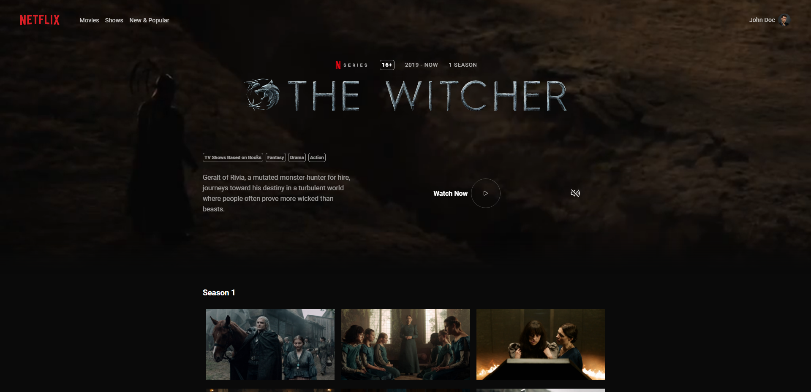

<h1 align="center">Netflix TV Show Page Concept</h1>
<p>
  
  <a href="https://github.com/godart-corentin/book-store#readme" target="_blank">
    
  </a>
</p>

> A Netflix TV Show Page concept made with React

### 🏠 [Homepage](https://github.com/godart-corentin/book-store#readme)

<p align="middle">

</p>

## Prerequisites

- Node.js
- Yarn or npm

## Install

```sh
yarn install
```

## Usage

```sh
yarn start
```

## Author

### Implementation

👤 **Corentin Godart**

- Github: [@godart-corentin](https://github.com/godart-corentin)
- LinkedIn: [@corentin-godart](https://linkedin.com/in/corentin-godart)

### Original design

👤 **Dezzars**

- Dribbble: [@dezzars](https://dribbble.com/dezzars)
- Behance: [@Dezzars](https://www.behance.net/Dezzars)
- Original Design link: [here](https://dribbble.com/shots/16388799-Netflix-Movie-Page-Concept)

## Warning

All graphic resources used for this site are owned by Netflix. All rights to The Witcher series are theirs.

## 🤝 Contributing

Contributions, issues and feature requests are welcome!<br />Feel free to check [issues page](https://github.com/godart-corentin/book-store/issues).

## Show your support

Give a ⭐️ if this project helped you!
